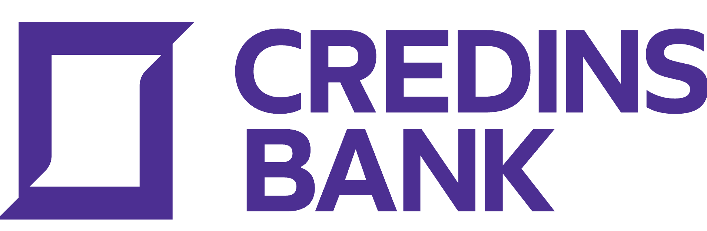
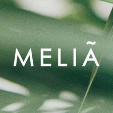
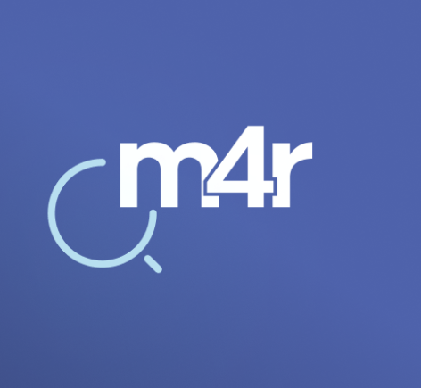
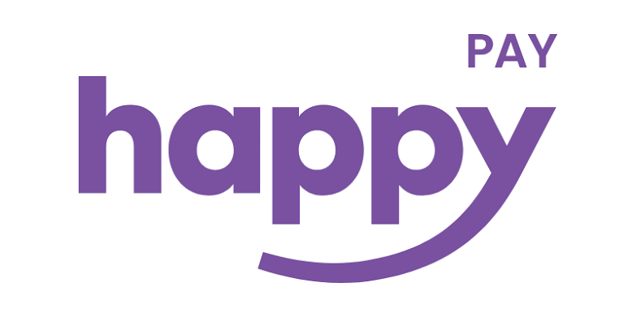

Four partner companies, one challenge each
{: .ib-pagehead__kicker }

# Four companies, ==four real questions==

Each partner company brings a question it is working on right now. Watch the videos, pick the challenge you care about most, and come to Monday ready to ask the companies what you still need to know.
{: .ib-lead }

  

    Monday, 10:00
    <strong>Challenge presentations</strong>
    Each company presents the context, the need behind it and what it expects from the solutions.
  

  

    Monday, 11:00
    <strong>Speed dating with partners</strong>
    Short meetings with company representatives to gather more information about the challenges.
  

  

    Friday, 14:30
    <strong>Final pitches</strong>
    Teams present their final concept to the jury and the partner companies.
  

<nav class="ib-chjump" aria-label="Jump to a challenge">
  <a href="#credins-bank">Credins Bank</a>
  <a href="#melia-durres">Resort Meliá Durrës</a>
  <a href="#gener-2">Gener 2</a>
  <a href="#happy">Happy</a>
</nav>

<!--
  Adding a video: replace href="https://www.youtube.com" with the video link,
  and replace the ... line with:
  
  VIDEO_ID is the part after "v=" (or after "youtu.be/") in the link.
-->

  <article class="ib-challenge" id="credins-bank">
    

      

        
        <strong>Credins Bank</strong><small>Challenge 1</small>
      

      
How can Credins Bank evolve from a financial intermediary into a <mark>trusted partner for young people</mark>, helping them discover their potential, develop it, and connect it to real-life opportunities?

      <ul class="ib-tags"><li>Young people</li><li>Talent development</li><li>Real-life opportunities</li></ul>
    

    <a class="ib-video" href="https://www.youtube.com" target="_blank" rel="noopener" aria-label="Watch the Credins Bank challenge video">
      Video coming soon
    </a>
  </article>

  <article class="ib-challenge" id="melia-durres">
    

      

        
        <strong>Resort Meliá Durrës</strong><small>Challenge 2</small>
      

      
How can Meliá Durrës become the <mark>employer of choice</mark> for Albania's next generation by innovating the employee experience to attract, onboard, engage, and retain top talent in an increasingly competitive hospitality industry?

      <ul class="ib-tags"><li>Employee experience</li><li>Talent retention</li><li>Hospitality</li></ul>
    

    <a class="ib-video" href="https://www.youtube.com" target="_blank" rel="noopener" aria-label="Watch the Resort Meliá Durrës challenge video">
      Video coming soon
    </a>
  </article>

  <article class="ib-challenge" id="gener-2">
    

      

        
        <strong>Gener 2</strong><small>Challenge 3</small>
      

      
How can Gener 2 leverage <mark>technology and AI</mark> in its new projects to develop and manage innovative systems while delivering a better customer experience?

      <ul class="ib-tags"><li>Technology and AI</li><li>Smart systems</li><li>Customer experience</li></ul>
    

    <a class="ib-video" href="https://www.youtube.com" target="_blank" rel="noopener" aria-label="Watch the Gener 2 challenge video">
      Video coming soon
    </a>
  </article>

  <article class="ib-challenge" id="happy">
    

      

        
        <strong>Happy</strong><small>Challenge 4, BALFIN Group</small>
      

      
Design a <mark>gamification feature</mark> for Happy, and show how AI can make it more personal, more engaging and more useful.

      <ul class="ib-tags"><li>Gamification</li><li>Personalisation with AI</li><li>Engagement</li></ul>
    

    <a class="ib-video" href="https://www.youtube.com" target="_blank" rel="noopener" aria-label="Watch the Happy challenge video">
      Video coming soon
    </a>
  </article>

## What the jury looks for

On Friday the jury evaluates every pitch on the same five criteria, whichever challenge your team chose.
{: .ib-lead }

<ol class="ib-criteria">
  <li><strong>Innovation</strong>Is the idea new, or a fresh take on the problem?</li>
  <li><strong>Relevance</strong>Does it answer the company's question and the need behind it?</li>
  <li><strong>Feasibility</strong>Could it realistically be built and put to use?</li>
  <li><strong>Scalability</strong>Could it grow beyond a first version or a first group of users?</li>
  <li><strong>Potential impact</strong>How much difference could it make, and for whom?</li>
</ol>

  Not sure where to start?
  <a class="ib-next__link" href="../training/01-problem-identification/"><strong>Module 1: Problem identification</strong>Prepare before Monday</a>

