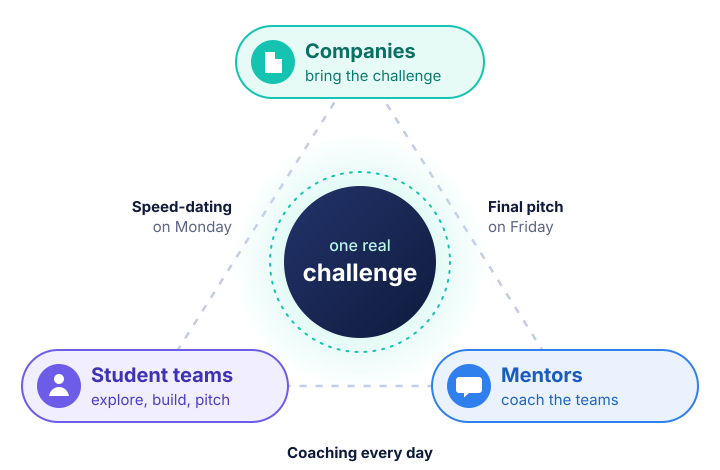

<!-- The hero (headline, buttons and participant pass) is in overrides/home.html -->

<section class="ib-section ib-why" markdown>

## Good ideas start with a ==real need==

Most student projects begin with a technology and then go looking for a use. Here it works the other way round. First the problem, then the people who live with it, and only then the solution.
{: .ib-lead }

The bootcamp is organised by [Match4Research](partners.md) and the Faculty of Economy at the University of Tirana, with support from universities, embassies and local institutions.
{: .ib-note }

:material-magnify:
{: .ib-goal__icon }

### Start from the problem

Spot a real need, size it, and check it with the people who have it before you build anything.

:material-briefcase-outline:
{: .ib-goal__icon }

### Work on challenges that matter

Companies bring problems from their day to day, and they are in the room when you present your answer.

:material-handshake-outline:
{: .ib-goal__icon }

### Bring campus and industry together

Students, lecturers and companies share a table for a whole week. The conversations tend to outlast it.

:material-rocket-launch-outline:
{: .ib-goal__icon }

### Think like a founder

You don't have to start a company. Thinking like someone who could will still change how you work.

</section>

<section class="ib-section ib-band ib-how" markdown>

<figure class="ib-how__figure">
  
</figure>

## Three groups around ==one challenge==

Each partner company brings one problem it is dealing with right now. Everything that happens during the week points back to it.
{: .ib-lead }

<ul class="ib-roles">
  <li class="ib-role--companies"><strong>Companies</strong> present their challenge on Monday and meet the teams one to one, so you can ask the questions that matter.</li>
  <li class="ib-role--students"><strong>Student teams</strong> from different universities and fields explore the problem, test it with real people, build a first version and pitch it.</li>
  <li class="ib-role--mentors"><strong>Mentors</strong> check in with every team each day, push back on weak assumptions and help you sharpen the pitch.</li>
</ul>

[Browse the challenges](challenges/index.md){ .ib-textlink }
{: .ib-more }

</section>

<section class="ib-section" markdown>

## From first idea to ==final pitch==

Days run from 9:00 to 16:15, with coaching throughout. Evenings are for getting to know Durrës and each other.
{: .ib-lead }

[See the full agenda](agenda.md){ .ib-textlink }
{: .ib-more }

<ol class="ib-week">
  <li class="ib-day">
    Monday 26 October
    <h3>Challenges and teams</h3>
    
Companies present their challenges and you meet them one to one. By the afternoon you have a team and a problem you want to take on.

    Albanian Taste and Entrepreneurship Evening
  </li>
  <li class="ib-day">
    Tuesday 27 October
    <h3>Explore and validate</h3>
    
Your team takes the problem apart, writes down what you are assuming, and tests it with people who actually live with it.

    Innovation walk along the Adriatic
  </li>
  <li class="ib-day">
    Wednesday 28 October
    <h3>Shape the solution</h3>
    
With the problem confirmed, you pick a direction, start building, and map everyone who has a stake in it.

    Bowling or beach volleyball
  </li>
  <li class="ib-day">
    Thursday 29 October
    <h3>Prototype and rehearse</h3>
    
Part of the team builds while the rest works on the pitch. Mentors help you tighten both.

    Music night with a pianist
  </li>
  <li class="ib-day ib-day--final">
    Friday 30 October
    <h3>Demo day</h3>
    
Pitch clinics in the morning and final pitches after lunch. The jury decides, then we close with the awards.

    White Sensation Night, run by the students
  </li>
</ol>

</section>

<section class="ib-section" markdown>

## Get ready before you arrive

Each module is a short set of videos and tools. Go through it before the day it is used, so your time on site goes into working with your team.
{: .ib-lead }

[Training overview](training/index.md){ .ib-textlink }
{: .ib-more }

  <a class="ib-module" href="training/01-problem-identification/">
    1
    Problem identification
    Find the pain, size it and show that it is real.
    Before Monday
  </a>
  <a class="ib-module" href="training/02-design-thinking/">
    2
    Design thinking
    Move from what you assume to what users tell you.
    Before Tuesday
  </a>
  <a class="ib-module" href="training/03-impact/">
    3
    Making an impact
    Customers, value proposition, USP and business model.
    Before Wednesday
  </a>
  <a class="ib-module ib-module--optional" href="training/04-team-dynamics/">
    4
    Team dynamics
    Short extras for working well together under pressure.
    Optional
  </a>
  <a class="ib-module" href="training/05-pitching/">
    5
    Pitching
    Tell the story of your project in a few minutes.
    Before Thursday
  </a>

</section>

<section class="ib-section ib-duo" markdown>

## Your mentors

Educators and practitioners from TU Eindhoven, UnternehmerTUM, the University of Tirana, Metropolitan Tirana University, Holberton, Qnomi and Lufthansa Industry Solutions. They work with the teams every day.
{: .ib-lead }

  
GGGert GuriTU Eindhoven

  
AHArvid HendriksQnomi

  
KHKei HysiUnternehmerTUM

  
ASAlba SkendajFaculty of Economy, UT

  
BKBrunilda KostaFaculty of Economy, UT

  
BPBruna PapaFaculty of Economy, UT

  
EPEvis PlakuHolberton and UMT

  
KKKedi KalajLufthansa Industry Solutions

[Meet the mentors](mentors.md){ .ib-textlink }
{: .ib-more }

## Partners

The organisations that make the week possible, from universities to companies and local institutions.
{: .ib-lead }

  <figure class="ib-logo"><figcaption>Match4Research</figcaption></figure>
  <figure class="ib-logo"><figcaption>Faculty of Economy, UT</figcaption></figure>
  <figure class="ib-logo"><figcaption>Credins Bank</figcaption></figure>
  <figure class="ib-logo"><figcaption>Melia Durrës</figcaption></figure>
  <figure class="ib-logo"><figcaption>Gener 2</figcaption></figure>
  <figure class="ib-logo"><figcaption>Happy, Balfin Group</figcaption></figure>
  <figure class="ib-logo"><figcaption>Metropolitan Tirana University</figcaption></figure>
  <figure class="ib-logo"><figcaption>Holberton School</figcaption></figure>

[All partners](partners.md){ .ib-textlink }
{: .ib-more }

</section>

<section class="ib-section" markdown>

  

    <h2>Joining as a student?</h2>
    
Start with Module 1, then check the FAQ for what to bring and how teams are formed.

    <a class="ib-btn ib-btn--primary" href="training/01-problem-identification/">Open Module 1</a>
  

  

    <h2>Have a problem worth five days?</h2>
    
If your company has a challenge you would like fresh eyes on, take a look at this year's challenges and get in touch with the organisers.

    <a class="ib-btn ib-btn--light" href="challenges/">See the challenges</a>
  

</section>
