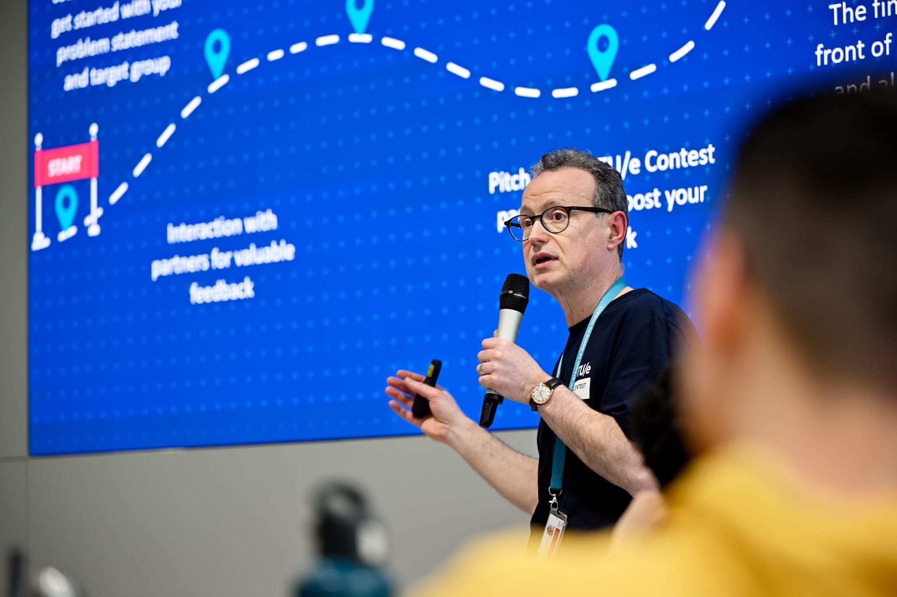
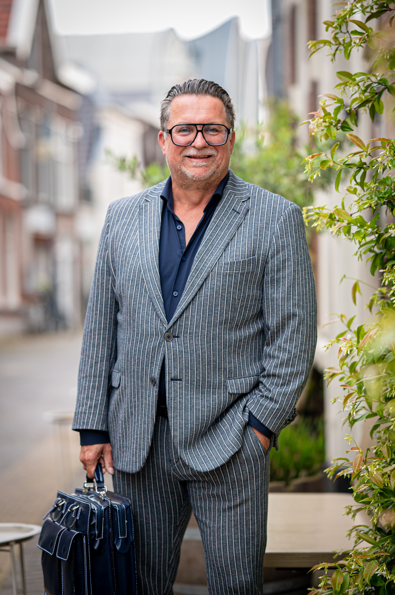
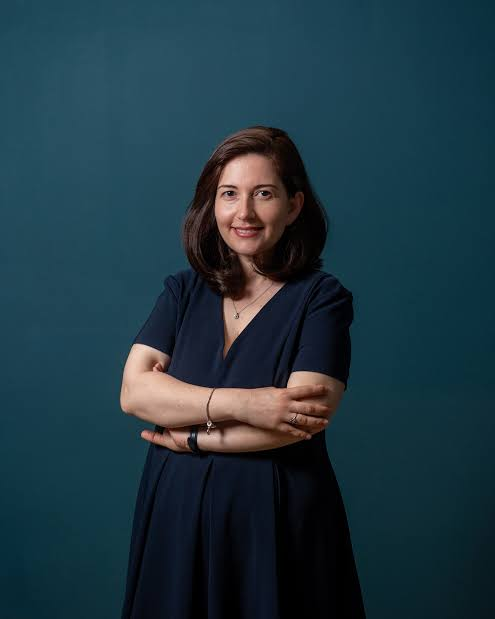
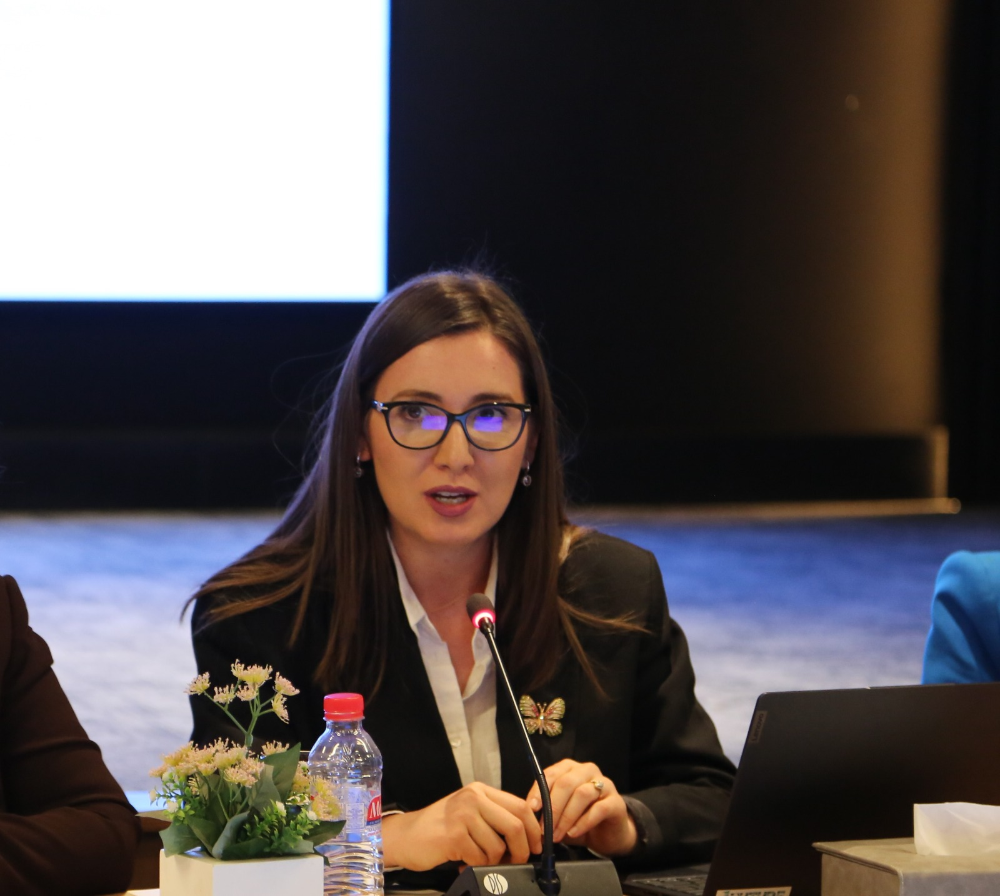
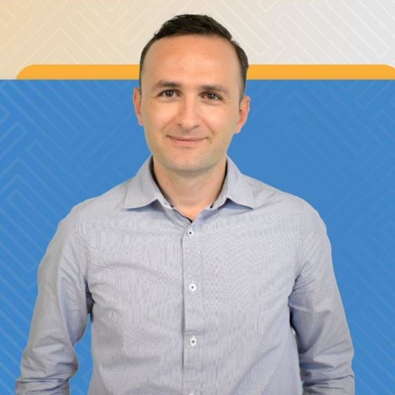

Seven mentors, with the teams every day
{: .ib-pagehead__kicker }

# The people ==in your corner==

They come from universities, innovation hubs and companies across Europe and Albania, and between them they have coached hundreds of student teams. Their job this week is simple: ask the hard questions early, so you don't hear them for the first time from the jury.
{: .ib-lead }

  

    Every day
    <strong>Coaching rounds</strong>
    Mentors rotate between teams during work sessions. Grab them when you are stuck.
  

  

    Wednesday and Thursday, 09:00
    <strong>Progress pitches</strong>
    A short update from each team, with direct feedback from the mentors.
  

  

    Friday morning
    <strong>Pitch clinics</strong>
    Run your final pitch with a mentor and fix what does not land yet.
  

{ loading=lazy }

TU Eindhoven

### Gert Guri

Coordinator of Education on Entrepreneurial Learning, Eindhoven University of Technology

<ul class="ib-tags"><li>Challenge-based learning</li><li>Team dynamics</li><li>Entrepreneurial mindset</li></ul>

Coaches around 70 student teams a year on real projects and teaches at TUM, DTU, HEC Paris and TalTech. Spent close to 20 years working with organisations such as EIT Digital.

Read full bio

Gert works as Coordinator of Education on Entrepreneurial Learning at TU/e, where he teaches and mentors innovation and entrepreneurship with interdisciplinary student teams. He uses a challenge-based approach across curricular and extracurricular activities, coaching around 70 teams each year on real-life, impact-driven projects.

His aim is to shape the "π-shaped" engineers of the future, paying close attention to innovation and cultural interaction as the basis for strong, complementary teams. Over roughly 20 years he has worked with organisations including the European Institute of Innovation and Technology (EIT) Digital, and he teaches at TUM (Munich), DTU (Copenhagen), HEC (Paris) and TalTech (Tallinn), among others.

He likes to tell students that the most important skill is to keep reinventing yourself and hold on to an entrepreneurial mindset throughout your career. He enjoys challenging his students in mentoring sessions, and on the football pitch and volleyball court too.

{ loading=lazy }

Qnomi

### Arvid Hendriks

Entrepreneur, consultant and leadership developer, Q management and Qnomi

<ul class="ib-tags"><li>Leadership</li><li>Behavioural profiling</li><li>Scale-up strategy</li></ul>

Co-founder of Qnomi, a DISC-based psychometric platform, and part of the leadership practice Q management since 1997. Certified training partner of GIMI and IXL Center since 2022.

Read full bio

Arvid is a Dutch entrepreneur, consultant and leadership developer based in the Alphen aan den Rijn and The Hague region of the Netherlands. He holds an MSc in Corporate Strategy and studied Economics at Erasmus University Rotterdam.

He works across several ventures, most notably Q management, the strategic facilitation and leadership development practice founded by his father in 1981, which Arvid joined in April 1997, and Qnomi, a DISC-based psychometric platform he co-founded. His expertise covers behavioural profiling, leadership development, scale-up strategy and executive coaching.

Since 2022 he has been a Certified Training Partner of GIMI and IXL Center (USA), focusing on innovation training and consulting and mentoring teams working on innovation. He is also co-founder of The Base Model, an organisational philosophy for scale-ups launching in 2026, which he will present at the CXO 2.0 Conference in Dubai. His guiding line for the leaders he works with: "inspiring leaders to find the new magic".

{ loading=lazy }

UnternehmerTUM

### Kei Hysi

Entrepreneurship Education Lead, UnternehmerTUM, Munich

<ul class="ib-tags"><li>Design thinking</li><li>Learning design</li><li>Leadership</li></ul>

Designs and runs design thinking and leadership programmes at one of Europe's leading innovation hubs. MSc from TU Munich, with research done at Stanford.

Read full bio

Kei is an education and learning design professional based in Munich. As Entrepreneurship Education Lead at UnternehmerTUM, Europe's leading innovation and entrepreneurship hub, she designs and facilitates programmes focused on design thinking and leadership.

She holds an MSc in Management and Technology from TU Munich and conducted research at Stanford University, with a peer-reviewed publication at the IEEE Frontiers in Education Conference (2023). Originally from Albania, she is actively involved in education development in her home country.

{ loading=lazy }

Faculty of Economy, UT

### Alba Skendaj

Founder of Match4Research and lecturer, Faculty of Economy, University of Tirana

<ul class="ib-tags"><li>Innovation</li><li>Circular economy</li><li>Social entrepreneurship</li></ul>

Founded Match4Research and has taught innovation, management and business ethics at the University of Tirana since 2011. Has mentored teams on challenges for Airbus, Royal Caribbean Group and Bank Muscat.

Read full bio

Dr. Alba Skendaj is the founder of the Match4Research platform and a full-time lecturer at the Faculty of Economy, University of Tirana, where she has taught since 2011. She holds degrees in both Economics and Law and completed her PhD at the Department of European Policy and Governance at the Institute of European Studies, University of Tirana.

She lectures in Innovation, Business Management and Business Ethics, and has extensive experience in academia and the non-profit sector, leading and contributing to many nationally and internationally funded projects. Her expertise includes research and innovation, educational leadership, circular economy, social entrepreneurship and VET. She is also a research associate at the University of Bologna and a part-time expert for national education institutions.

Since 2022 she has worked with GIMI and IXL Center (USA) on innovation training and consulting, mentoring teams on innovation challenges for global companies such as Airbus, Royal Caribbean Group, Ayala Corporation and Bank Muscat.

{ loading=lazy }

Faculty of Economy, UT

### Brunilda Kosta

Lecturer, Faculty of Economy, University of Tirana, and international consultant

<ul class="ib-tags"><li>Circular business models</li><li>Innovation management</li><li>Impact assessment</li></ul>

Over 13 years in innovation, circular economy and entrepreneurship, on projects funded by the EU, GIZ, Sida and the World Bank. Mentors startups, SMEs and young innovators across the Western Balkans.

Read full bio

Brunilda Kosta, PhD, PMP, is a lecturer at the Faculty of Economy, University of Tirana, and an international researcher, consultant and trainer with over 13 years of experience in innovation, circular economy, entrepreneurship and sustainable development.

She has led and contributed to many projects funded by the European Union, GIZ, Sida, the World Bank, CIPE, Helvetas and other international organisations. Her expertise spans innovation management, circular business models, policy development, impact assessment and business competitiveness across the Western Balkans. Alongside her research and consultancy work, she has mentored startups, SMEs, students and young innovators through regional entrepreneurship and innovation programmes.

She is the author of numerous scientific publications and currently serves as a Knowledge Hub Contributor for Circle Economy Foundation (Netherlands) and as an Expert for the European Labour Authority (ELA), connecting academia, policy and practice.

{ loading=lazy }

Faculty of Economy, UT

### Bruna Papa

Lecturer, Department of Management, Faculty of Economy, University of Tirana

<ul class="ib-tags"><li>Entrepreneurial education</li><li>Business communication</li><li>Ecosystems</li></ul>

PhD in Management on the entrepreneurial university model. Former Vice Dean of the Faculty of Economy, and from 2022 to 2025 an Employment Coordinator in Kelowna, Canada.

Read full bio

Dr. Bruna Papa is a management expert and university lecturer with more than a decade of experience in higher education, public engagement and employment programme coordination in Albania and Canada. She holds a PhD in Management from the University of Tirana, with research on the entrepreneurial university model in public higher education.

From 2022 to 2025 she was Employment Coordinator at Kelowna Community Resources Society in Canada, where she led federal and provincial employment programmes, developed training curricula and built partnerships with local businesses, academic institutions and government agencies. Before that she held several senior roles at the University of Tirana, including Director of External Relations and Projects, Vice Dean of the Faculty of Economy, and project coordinator for EU and donor-funded initiatives such as PACINNO, Interface and Erasmus+ mobility programmes.

She has completed training programmes in Canada, the USA and Europe, with certifications from the University of British Columbia, the University of Alberta and Okanagan College. She teaches Business Communication and Entrepreneurship and Small Business Management.

{ loading=lazy }

Holberton and UMT

### Evis Plaku

Academic Director, Holberton Albania, and Computer Science Lecturer, Metropolitan Tirana University

<ul class="ib-tags"><li>AI and machine learning</li><li>Product development</li><li>Robotics</li></ul>

Helps teams turn ideas into working technology. MSc in AI and Robotics from the University of Freiburg and a PhD candidate in Artificial Intelligence.

Read full bio

Evis works to make technology useful in practice, helping individuals and teams learn, develop ideas and build solutions with real impact. He is a Computer Science Lecturer at Metropolitan Tirana University, a PhD candidate in Artificial Intelligence, and Academic Director at Holberton Albania.

He holds a Master's degree in Artificial Intelligence and Robotics from the University of Freiburg (Germany), has done research at The Catholic University of America in Washington, D.C., and holds a degree in Computer Science from the University of Tirana. His areas of expertise include artificial intelligence, machine learning, robotics and technology product development, as well as mentoring individuals and multidisciplinary teams.

## Who to talk to when you are stuck

Every mentor works with every team, but some questions have an obvious first stop.
{: .ib-lead }

  
Is this problem real, and how do we check?<a href="#gert-guri">Gert</a><a href="#kei-hysi">Kei</a><a href="#alba-skendaj">Alba</a>

  
Understanding users and testing ideas with them<a href="#kei-hysi">Kei</a><a href="#gert-guri">Gert</a>

  
Business model, value proposition and impact<a href="#alba-skendaj">Alba</a><a href="#brunilda-kosta">Brunilda</a>

  
Sustainability and circular ideas<a href="#brunilda-kosta">Brunilda</a><a href="#alba-skendaj">Alba</a>

  
Roles, friction and decisions inside the team<a href="#arvid-hendriks">Arvid</a><a href="#gert-guri">Gert</a>

  
Building the prototype, especially anything with data or AI<a href="#evis-plaku">Evis</a>

  
Telling the story and presenting it<a href="#bruna-papa">Bruna</a><a href="#arvid-hendriks">Arvid</a>

